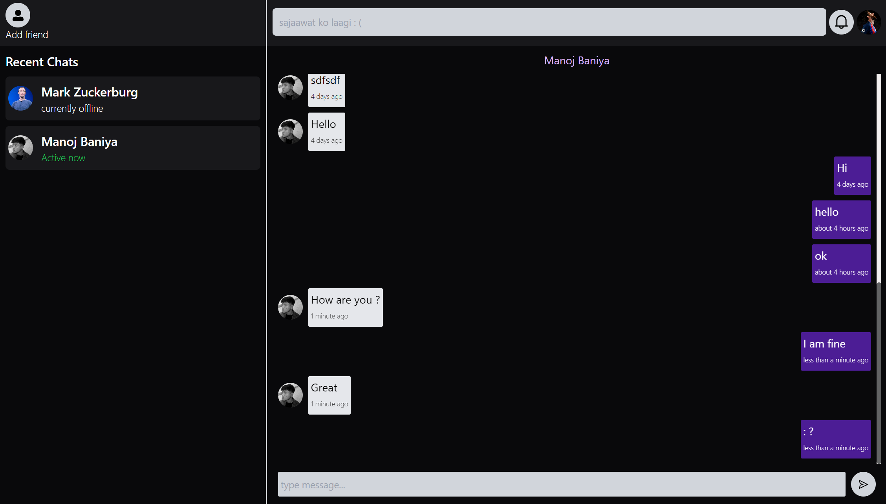

# MERN Stack Chat Application

This is a full-stack chat application built using the MERN stack (MongoDB, Express.js, React.js, Node.js). It allows users to register, log in, and communicate with each other in real time.

## Features

- User authentication (register, login, logout)
- Real-time chat functionality
- Responsive design
- MongoDB database for storing messages and user information

## Technologies Used

- MongoDB
- Express.js
- React.js
- Node.js
- Socket.io (for real-time communication)
- Tailwind CSS

## Preview

